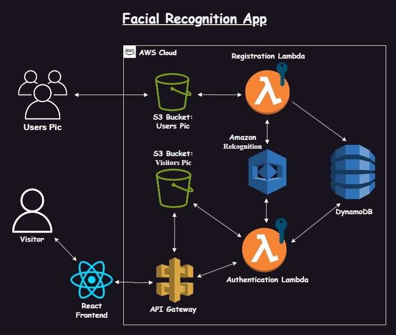

<h1>RecognizeMe: Facial Recognition App on AWS</h1>

Explore how to build a Facial Recognition App on AWS using powerful services such as Amazon Rekognition, AWS Lambda, Amazon DynamoDB, Amazon API Gateway, and Amazon S3 with a React front end. Let’s dive into the step-by-step process of creating this application.

<h2>Architecture</h2>

<h2>Flows</h2>

<h3>Flow #1: Registration Flow</h3>
<ol>
    <li><strong>Employee Image Upload</strong>: Employee pictures are uploaded to the 'employee-bucket-image' S3 bucket.</li>
    <li><strong>Trigger Registration Lambda</strong>: The upload triggers the Registration Lambda function.</li>
    <li><strong>Index Employee Pictures</strong>: The Registration Lambda function uses Amazon Rekognition to index the employee pictures.</li>
    <li><strong>Generate Rekognition ID</strong>: This process generates a unique Rekognition ID for each employee.</li>
    <li><strong>Store Employee Data</strong>: The employee's information, including the Rekognition ID, is stored in a DynamoDB table.</li>
</ol>

<h3>Flow #2: Authentication Flow</h3>
<ol>
    <li><strong>Visitor/Employee Image Upload</strong>: A visitor or employee uploads an image using the React front end.</li>
    <li><strong>Call API Gateway</strong>: The front end calls the API Gateway to handle the upload.</li>
    <li><strong>Store Image in Visitor S3 Bucket</strong>: The image is stored in the 'visitor-bucket-image' S3 bucket.</li>
    <li><strong>Trigger Authentication Lambda</strong>: The upload triggers the Authentication Lambda function.</li>
    <li><strong>Generate Unique Key</strong>: The Authentication Lambda function uses Amazon Rekognition to generate a unique key.</li>
    <li><strong>Check Rekognition ID</strong>: The Rekognition ID is checked against the entries in the DynamoDB table for authentication.</li>
</ol>

<h2>Getting Started</h2>
    
This guide provides step-by-step instructions for deploying a facial recognition application using AWS services such as EC2, Lambda, S3, DynamoDB, and Rekognition.

<h2>Prerequisites</h2>
<ul>
    <li>AWS Account</li>
    <li>Configured AWS CLI</li>
    <li>SSH client (e.g., PuTTY for Windows, ssh for macOS/Linux)</li>
    <li>Access to your AWS IAM management console</li>
</ul>

<h2>Steps to Deploy the Facial Recognition App</h2>

<h3>Step 1: Launch an EC2 Instance</h3>
<ol>
    <li>Open the EC2 Dashboard in the AWS Management Console.</li>
    <li>Click "Launch Instance" and follow the wizard to configure your instance.</li>
    <li>Select an Amazon Machine Image (AMI), e.g., Amazon Linux 2 AMI.</li>
    <li>Choose an instance type (e.g., t2.micro for free tier eligibility).</li>
    <li>Configure the instance details and add storage as needed.</li>
    <li>In the "Configure Security Group" step, add the following inbound rules:
        <ul>
            <li>HTTP (port 80) from 0.0.0.0/0</li>
            <li>HTTPS (port 443) from 0.0.0.0/0</li>
            <li>SSH (port 22) from your IP address</li>
        </ul>
    </li>
    <li>Review and launch your instance, creating a new key pair or using an existing one for SSH access.</li>
</ol>

<h3>Step 2: Connect to Your EC2 Instance</h3>
<ol>
    <li>Use an SSH client to connect to your instance. Replace <code>your-key.pem</code> with your key file and <code>your-ec2-public-dns</code> with your instance's public DNS.</li>
    <li>For Linux/macOS:
<pre><code>ssh -i your-key.pem ec2-user@your-ec2-public-dns</code></pre></li>
    <li>For Windows (using PuTTY):
        <ul>
            <li>Open PuTTY and enter <code>ec2-user@your-ec2-public-dns</code> in the Host Name field.</li>
            <li>Under Connection -> SSH -> Auth, browse and select your <code>.ppk</code> key file.</li>
            <li>Click "Open" to connect.</li>
        </ul>
    </li>
</ol>

<h3>Step 3: Install Necessary Software</h3>
<ol>
    <li>Update the instance and install required packages:
<pre><code>sudo yum update -y
sudo yum install python3 -y
sudo yum install git -y</code></pre></li>
    <li>Install Flask and Boto3:
<pre><code>pip3 install Flask boto3</code></pre></li>
</ol>

<h3>Step 4: Set Up the Flask Application</h3>
<ol>
    <li>Create a directory for your app and navigate into it:
<pre><code>mkdir app
cd app</code></pre></li>
    <li>Create and edit <code>app.py</code>.</li>
    <li>Create the <code>templates</code> directory and navigate into it:
<pre><code>mkdir templates
cd templates</code></pre></li>
    <li>Create and edit <code>index.html</code>.</li>
    <li>Create and edit <code>result.html</code>.</li>
</ol>

<h3>Step 5: Run the Flask Application</h3>
<ol>
    <li>Navigate to your app directory and run the Flask app:
<pre><code>export FLASK_APP=app.py
flask run --host=0.0.0.0</code></pre></li>
</ol>

<h3>Step 6: Attach IAM Role to EC2 Instance</h3>
<ol>
    <li>Open the IAM Dashboard in the AWS Management Console.</li>
    <li>Create a new IAM role with the following policies:
        <ul>
            <li>AmazonS3FullAccess</li>
            <li>AmazonDynamoDBFullAccess</li>
            <li>AmazonRekognitionFullAccess</li>
        </ul>
    </li>
    <li>Attach the IAM role to your EC2 instance.</li>
</ol>

<h3>Step 7: Upload Images to S3 Bucket</h3>
<ol>
    <li>Ensure you have an S3 bucket named <code>employee-img</code>, a Rekognition collection named <code>employees</code> (created using AWS CLI), and a DynamoDB table named <code>employees_collection</code> with the primary key <code>RekognitionId</code> (type string).</li>
    <li>Run the <code>putimages.py</code> script to upload images to the S3 bucket. The script will assign Rekognition IDs and store them in the DynamoDB table:
<pre><code>python3 putimages.py</code></pre></li>
</ol>

<h3>Step 8: Test the Application</h3>
<ol>
    <li>Open a web browser and navigate to your EC2 instance's public DNS.</li>
    <li>Upload an image and verify that the application processes it correctly.</li>
</ol>
