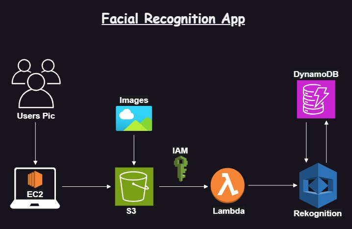

<h1>RecognizeMe: Facial Recognition App on AWS</h1>

This repository outlines the architecture of a Facial Recognition App using AWS services. The following is a step-by-step explanation of the flow:

<h2>Architecture Diagram</h2>

<h2>Flow Explanation</h2>

<ol>
    <li><strong>User's Picture Upload (EC2):</strong>
        
Users upload their pictures via an application running on an Amazon EC2 instance.

    </li>
    <li><strong>Storage (S3):</strong>
        
The uploaded pictures are stored in an Amazon S3 bucket. S3 is used for scalable storage of images.

    </li>
    <li><strong>Trigger (S3 to Lambda):</strong>
        
An event in S3 (such as a new image upload) triggers an AWS Lambda function. The Lambda function is configured with the necessary IAM (Identity and Access Management) permissions to access the S3 bucket and other AWS resources.

    </li>
    <li><strong>Processing (Lambda):</strong>
        
The Lambda function processes the image, which includes invoking the Amazon Rekognition service to analyze the image. Rekognition is a machine learning service that can perform facial analysis and recognition.

    </li>
    <li><strong>Analysis (Rekognition):</strong>
        
Amazon Rekognition analyzes the image to identify faces and compare them against a stored collection of faces.

    </li>
    <li><strong>Data Storage (DynamoDB):</strong>
        
The results from Rekognition, such as facial analysis data or identification results, are stored in an Amazon DynamoDB table. DynamoDB is a fast and flexible NoSQL database service.

    </li>
    <li><strong>Result Handling:</strong>
        
The application can then retrieve the results from DynamoDB to display or further process them as needed.

    </li>
</ol>

<h3>Summary of the Services Used:</h3>
<ul>
    <li><strong>Amazon EC2:</strong> Hosts the application where users upload images.</li>
    <li><strong>Amazon S3:</strong> Stores the uploaded images.</li>
    <li><strong>AWS Lambda:</strong> Handles the processing of images when they are uploaded to S3.</li>
    <li><strong>Amazon Rekognition:</strong> Analyzes the images for facial recognition.</li>
    <li><strong>Amazon DynamoDB:</strong> Stores the results of the facial recognition analysis.</li>
</ul>

This architecture leverages AWS services to create a scalable, serverless facial recognition application.

<h2>Getting Started</h2>
    
This guide provides step-by-step instructions for deploying a facial recognition application using AWS services such as EC2, Lambda, S3, DynamoDB, and Rekognition.

<h2>Prerequisites</h2>
<ul>
    <li>AWS Account</li>
    <li>Configured AWS CLI</li>
    <li>SSH client (e.g., PuTTY for Windows, ssh for macOS/Linux)</li>
    <li>Access to your AWS IAM management console</li>
</ul>

<h2>Steps to Deploy the Facial Recognition App</h2>

<h3>Step 1: Launch an EC2 Instance</h3>
<ol>
    <li>Open the EC2 Dashboard in the AWS Management Console.</li>
    <li>Click "Launch Instance" and follow the wizard to configure your instance.</li>
    <li>Select an Amazon Machine Image (AMI), e.g., Amazon Linux 2 AMI.</li>
    <li>Choose an instance type (e.g., t2.micro for free tier eligibility).</li>
    <li>Configure the instance details and add storage as needed.</li>
    <li>In the "Configure Security Group" step, add the following inbound rules:
        <ul>
            <li>HTTP (port 80) from 0.0.0.0/0</li>
            <li>HTTPS (port 443) from 0.0.0.0/0</li>
            <li>SSH (port 22) from your IP address</li>
        </ul>
    </li>
    <li>Review and launch your instance, creating a new key pair or using an existing one for SSH access.</li>
</ol>

<h3>Step 2: Attach IAM Role to EC2 Instance</h3>
<ol>
    <li>Open the IAM Dashboard in the AWS Management Console.</li>
    <li>Create a new IAM role with the following policies:
        <ul>
            <li>AmazonS3FullAccess</li>
            <li>AmazonDynamoDBFullAccess</li>
            <li>AmazonRekognitionFullAccess</li>
        </ul>
    </li>
    <li>Attach the IAM role to your EC2 instance.</li>
</ol>

<h3>Step 3: Upload Images to S3 Bucket</h3>
<ol>
    <li>Ensure you have an S3 bucket named <code>employee-img</code>, a Rekognition collection named <code>employees</code> (created using AWS CLI), and a DynamoDB table named <code>employees_collection</code> with the primary key <code>RekognitionId</code> (type string).</li>
    <li>Run the <code>putimages.py</code> script to upload images to the S3 bucket. The script will assign Rekognition IDs and store them in the DynamoDB table:
<pre><code>python3 putimages.py</code></pre></li>
</ol>

<h3>Step 4: Connect to Your EC2 Instance</h3>
<ol>
    <li>Use an SSH client to connect to your instance. Replace <code>your-key.pem</code> with your key file and <code>your-ec2-public-dns</code> with your instance's public DNS.</li>
    <li>Open CMD:
<pre><code>ssh -i path\to\your-key.ppk path\to\ec2-user@your-ec2-public-dns</code></pre></li>
    <li>In PuTTY:
        <ul>
            <li>Open PuTTY and enter <code>ec2-user@your-ec2-public-dns</code> in the Host Name field.</li>
            <li>Under Connection -> SSH -> Auth, browse and select your <code>.ppk</code> key file.</li>
            <li>Click "Open" to connect.</li>
        </ul>
    </li>
</ol>

<h3>Step 5: Install Necessary Software</h3>
<ol>
    <li>Update the instance and install required packages (PuTTY):
<pre><code>sudo yum update -y
sudo yum install python3 -y
sudo yum install git -y</code></pre></li>
    <li>Install Flask and Boto3:
<pre><code>pip3 install Flask boto3</code></pre></li>
</ol>

<h3>Step 6: Set Up the Flask Application</h3>
<ol>
    <li>Create a directory for your app and navigate into it:
<pre><code>mkdir app
cd app</code></pre></li>
    <li>Create and edit <code>app.py</code>.</li>
    <li>Create the <code>templates</code> directory and navigate into it:
<pre><code>mkdir templates
cd templates</code></pre></li>
    <li>Create and edit <code>index.html</code>.</li>
    <li>Create and edit <code>result.html</code>.</li>
</ol>

<h3>Step 7: Run the Flask Application</h3>
<ol>
    <li>Navigate to your app directory and run the Flask app:
<pre><code>export FLASK_APP=app.py
flask run --host=0.0.0.0</code></pre></li>
</ol>

<h3>Step 8: Test the Application</h3>
<ol>
    <li>Open a web browser and navigate to your EC2 instance's public DNS.</li>
    <li>Upload an image and verify that the application processes it correctly.</li>
</ol>
